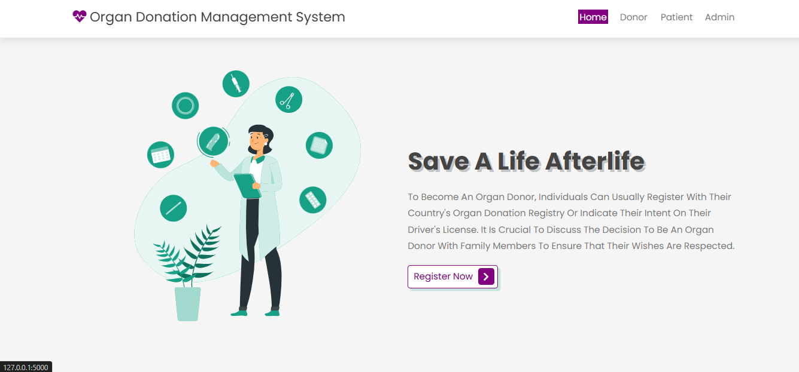
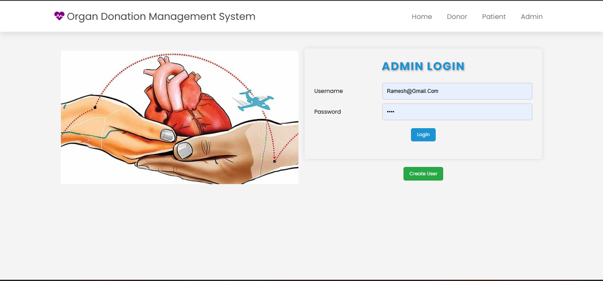
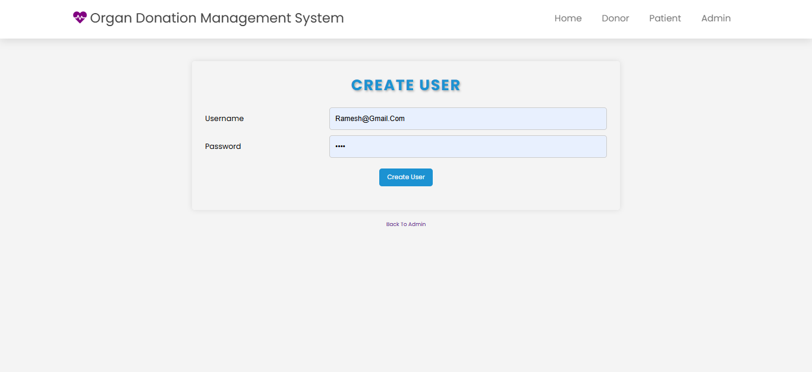
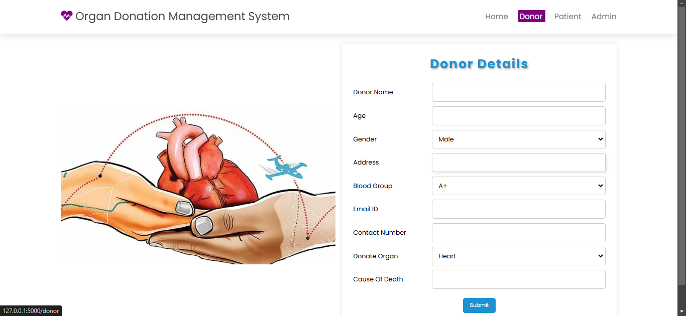
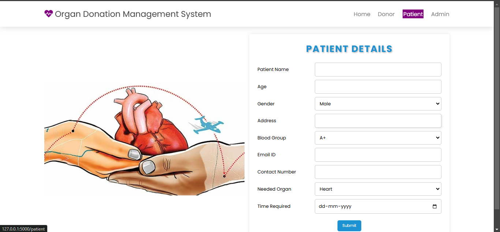
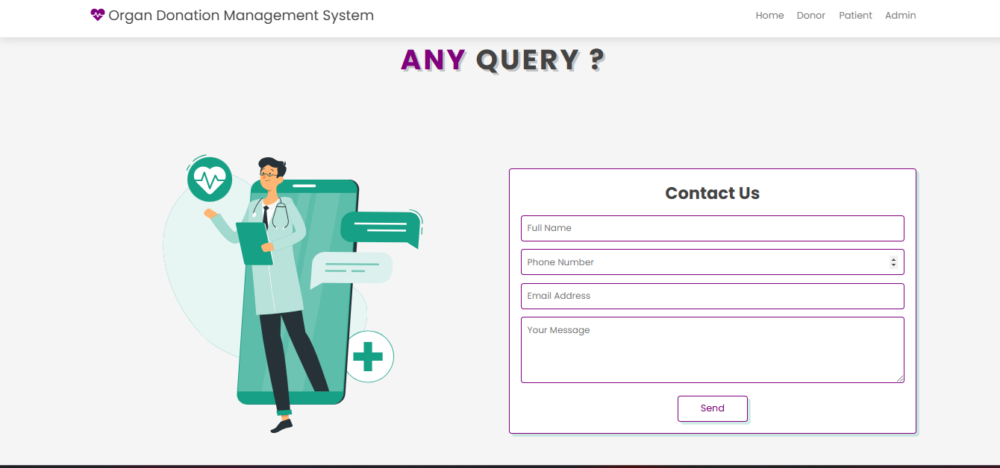
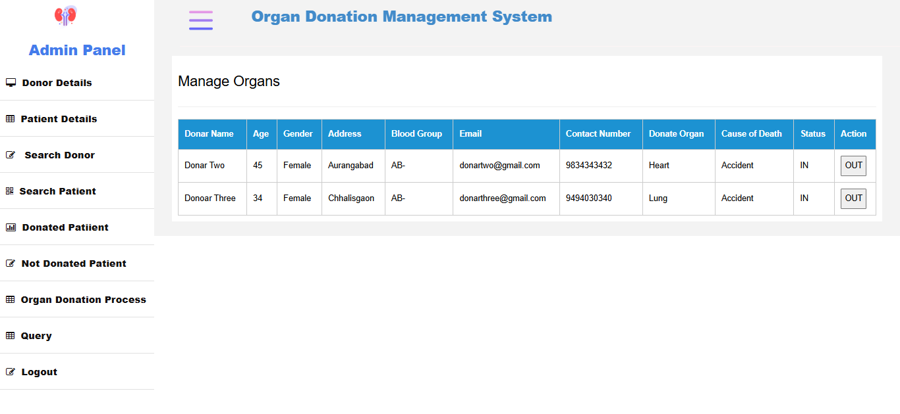

# Organ Donation Management System

This project is a web-based application designed to facilitate the organ donation and allocation process. The system manages donor registrations, patient registrations, and organ allocations. It includes an admin panel to oversee and manage the entire process efficiently. The application is built using HTML, CSS, JavaScript for the frontend, Flask (Python) for the backend, and MongoDB for data storage. It is deployed on AWS EC2 for cloud hosting.

## Table of Contents

- [Project Overview](#project-overview)
- [Features](#features)
- [Tech Stack](#tech-stack)
- [Usage](#usage)
- [Installation](#installation)
- [API Endpoints](#api-endpoints)
- [Deployment](#deployment)
- [Screenshots](#Result-Sc)


## Project Overview

The Organ Donation Management System aims to streamline the process of organ donation by providing a centralized platform for managing donor and patient information, tracking the availability of organs, and allocating organs to patients in need.

### Key Components:
- **Home Page**: Highlights the importance of organ donation and provides information on how the system works.
- **Donor Registration**: Allows individuals to register as organ donors.
- **Patient Registration**: Enables hospitals or patients to register those in need of organ transplants.
- **Admin Panel**: A secured panel for administrators to manage organ donations, allocate organs to registered patients, and view system statistics.
- **Organ Status**: Displays available organs and matches them with registered patients based on compatibility.

## Features

- **Donor and Patient Registration**: Simple forms for registering donors and patients.
- **Organ Status Dashboard**: View the current status of available organs and their allocations.
- **Admin Authentication**: Secure login for the admin panel.
- **Organ Allocation**: Admin can allocate available organs to matching patients.
- **Responsive Design**: User-friendly interface that works across different devices.
- **Cloud Deployment**: Hosted on AWS EC2 for scalability and reliability.

## Tech Stack

### Frontend:
- **HTML, CSS, JavaScript**: Used to build the user interface.

### Backend:
- **Python (Flask)**: Backend framework for handling the server-side logic and APIs.
- **MongoDB**: NoSQL database for storing donor, patient, and organ information.

### Deployment:
- **AWS EC2**: Cloud server for hosting the application.

## Installation

### Prerequisites
Make sure you have the following installed on your machine:
- Python 3
- MongoDB
- Flask
- Git


## Usage

### Home Page
The **Home Page** provides an overview of the importance of organ donation and how to participate in the organ donation process. It educates visitors about the benefits of organ donation and offers guidance on how to register as a donor or a patient.

### Donor Registration
Navigate to the **Donor Registration** page to fill out the donor information form. This form collects essential details such as:
- Full Name
- Contact Information
- Organs available for donation

By completing this form, individuals express their willingness to donate specific organs, which will be stored in the database for future matches with patients in need.

### Patient Registration
Navigate to the **Patient Registration** page to register a patient who is in need of an organ. The registration form collects key information, including:
- Patient's Name
- Contact Information
- The specific organ needed for transplantation

This information helps administrators in matching patients with compatible donors based on organ availability.

### Organ Status
The **Organ Status** page provides a comprehensive overview of available organs and their current compatibility with registered patients. The page includes:
- List of available organs
- Compatibility details
- Information on patients currently waiting for specific organs

This page helps in managing the organ allocation process effectively by providing real-time data.

### Admin Panel
The **Admin Panel** is a secured section accessible only by authorized personnel. It allows administrators to:
1. **Login** using their admin credentials.
2. Manage records for both donors and patients.
3. **Allocate available organs** to registered patients based on priority, compatibility, and medical necessity.
4. View detailed system statistics and data summaries to track the entire organ donation and allocation process.
5. **Update and delete** donor/patient records as needed to maintain an accurate and current database.


## API Endpoints

Below is a list of key API endpoints used in the backend to manage and access the data for the Organ Donation Management System:

- **GET** `/api/donors`  
  Retrieve a list of all registered donors. This endpoint returns a JSON object containing details of all the donors in the system.

- **POST** `/api/donors`  
  Register a new donor. This endpoint expects a JSON payload with donor information, such as name, contact details, and the organs available for donation.

- **GET** `/api/patients`  
  Retrieve a list of all registered patients. This endpoint returns a JSON object with patient details, including the organs they are in need of.

- **POST** `/api/patients`  
  Register a new patient. This endpoint requires a JSON payload with patient information, such as name, contact details, and the organ required.

- **POST** `/api/login`  
  Admin authentication endpoint. This endpoint expects admin credentials (username and password) and returns an authentication token if the login is successful.

- **PUT** `/api/allocate`  
  Allocate an organ to a patient. This endpoint requires a JSON payload specifying the donor, the patient, and the organ to be allocated, facilitating the organ matching and allocation process.


### Steps for Local Deployment
1. **Clone the Repository**:
   ```bash
   git clone https://github.com/your-username/organ-donation-system.git
   cd organ-donation-system
2. **Setup Virtualenvironment**:
    ```bash
    pip install virtualenv
    virtualenv venv
    venv\Scripts\Activate
3.  **Install the Required Libraries**:
      ```bash
      pip install -r requirements.txt
4.  **Run the Application**:
      ```bash
       python app.py

## Screenshots

Here are the screenshots for various sections of the application:

### Home Page
This is a screenshot of the application's home page.



### Admin Login
The admin login interface, where administrators can access the admin panel.



### Create User
Form to create a new user account.



### Donor Form
Form for registering as a donor.



### Patient Form
Form for registering a patient in need of an organ.



### Query Form
Interface to submit queries related to organ donation.



### Admin Panel
The admin panel for managing users, donors, and organ allocation.




   
